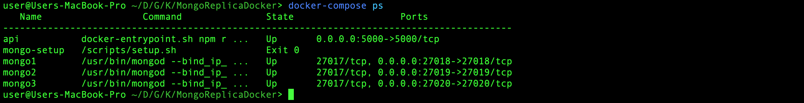
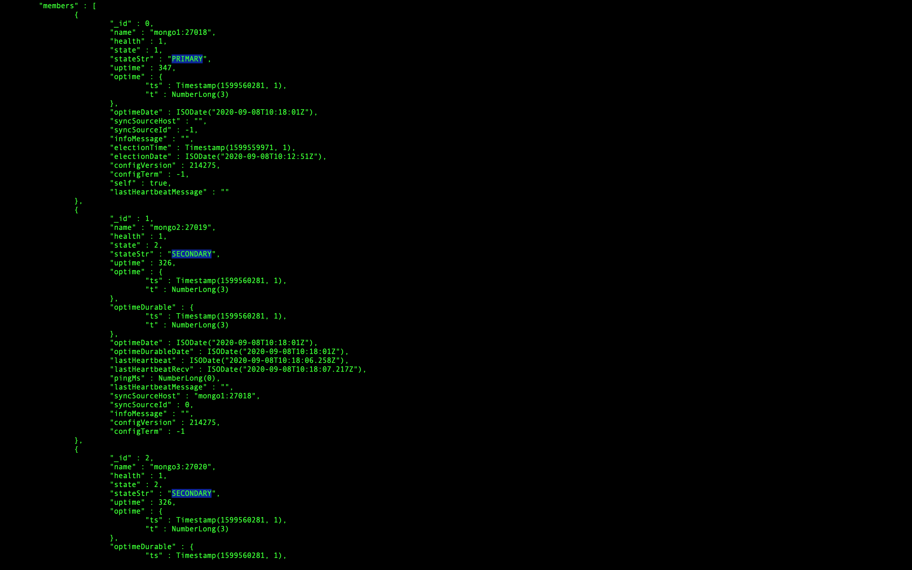
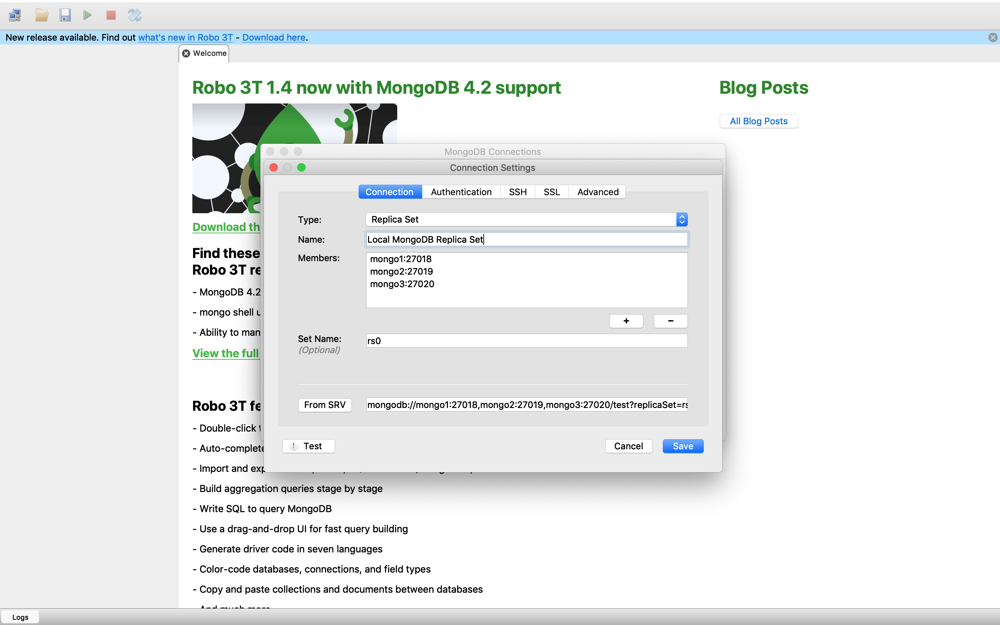
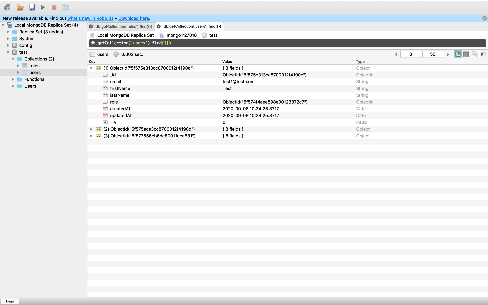

# MongoDB replica set with docker-compose
This is a simple configuration to set up MongoDB with a three-member replica set on a local environment with docker-compose. It can be helpful if you want to test Mongo transactions locally.

## Steps to run the project
#### 1. Clone the project
You will need the *docker-compose.yaml* file and the *scripts/* directory. The docker-compose file contains the configurations for creating the three-member replica set and a Node.js Express API for testing the configuration. There is also a temporary container *(mogo-setup)* which is created at the beginning and it is used to configure and start the replica-set (it uses the *scripts/setup.sh* script to do so). 
#### 2. Start the containers
Move to the project directory and start the containers. It should take a few seconds to start all Mongo instances and configure the replica set. 

```
$ docker-compose up --build -d
```
#### 3. Verify that the setup has succeeded
First, check the status of the containers:

```
$ docker-compose ps
```

You should get the following output:



Next, check the status of the replicas:
```
$ docker exec -it mongo1 mongo --port 27018
$ rs.status();
```

You should see the three Mongo replicas, where mongo1 is the PRIMARY instance and the other two are SECONDARY instances:




#### 4. Test transactions 

```
$ curl  -d  '{"email": "test1@test.com", "firstName":"Test", "lastName":"1", "role":"user"}'  -H  "Content-Type: application/json"  -X  POST  http://localhost:5000/users
{"_id":"5f575e313cc8700012f4190c","email":"test1@test.com","firstName":"Test","lastName":"1","role":"5f574f4aee898e00123872c7","createdAt":"2020-09-08T10:34:25.871Z","updatedAt":"2020-09-08T10:34:25.871Z","__v":0}

$ curl  http://localhost:5000/users
{"_id":"5f575ece3cc8700012f4190d","email":"test2@test.com","firstName":"Test","lastName":"2","role":"5f574f59ee898e00123872ca","createdAt":"2020-09-08T10:37:02.648Z","updatedAt":"2020-09-08T10:37:02.648Z","__v":0}
```

#### 5. Connect to Robo 3T
Firstly, update the *etc/hosts* file and add the following line:
`127.0.0.1 localhost mongo1 mongo2 mongo3`
 
Then, create a new connection in Robo 3T with the following configuration:
 


We can test the connection by querying the data:



## References:
- https://gist.github.com/asoorm/7822cc742831639c93affd734e97ce4f
- https://gist.github.com/harveyconnor/518e088bad23a273cae6ba7fc4643549
- https://gist.github.com/oleurud/d9629ef197d8dab682f9035f4bb29065
- https://stackoverflow.com/questions/47998855/connect-to-mongodb-replica-set-running-inside-docker-with-java-windows
